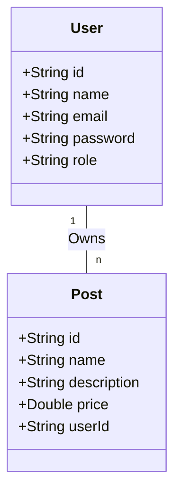

# LET'S PLAY

A Java backend project using **Hexagonal Architecture**, integrated with **MongoDB**, and containerized using **Docker**. Follows clean architecture principles with clear separation of concerns between domain logic, application logic, and infrastructure.

---

## Project Structure

```text
src/main/java/com/blog/
├── blogApplication.java
├── domain/            # Core business logic
│   ├── model/
│   ├── port/
│   │   ├── in/       # Input ports (use cases)
│   │   └── out/      # Output ports (interfaces)
│   └── service/      # Domain services
├── infrastructure/   # External concerns
│   ├── config/
│   ├── persistence/  # Database adapters
│   └── security/
└── application/      # Application layer
    ├── controller/   # REST controllers
    ├── dto/          # Request & Response DTOs
    └── exception/    # Global exception handling

Other files:
├── .env-example      # Example environment variables
├── compose.yaml      # Docker Compose config
├── pom.xml           # Maven config
└── setup.sh          # Setup environment script
```

---

## Endpoints

| Method | Endpoint         | Auth | Roles      | Description              |
| ------ | ---------------- | ---- | ---------- | ------------------------ |
| POST   | `/auth/register` | ❌    | -          | Register a new user      |
| POST   | `/auth/login`    | ❌    | -          | User login               |
| GET    | `/users`         | ✅    | Admin      | List all users           |
| GET    | `/users/{id}`    | ✅    | Admin/User | Get user by ID           |
| GET    | `/users/me`      | ✅    | Any        | Get current user profile |
| POST   | `/users`         | ✅    | Admin      | Create user              |
| PATCH  | `/users/{id}`    | ✅    | Admin/User | Update user details      |
| DELETE | `/users/{id}`    | ✅    | Admin/User | Delete user              |
| GET    | `/posts`      | ❌    | -          | List all posts        |
| GET    | `/posts/{id}` | ❌    | -          | Get post by ID        |
| POST   | `/posts`      | ✅    | Admin      | Create a post         |
| PATCH  | `/posts/{id}` | ✅    | Admin      | Update post           |
| DELETE | `/posts/{id}` | ✅    | Admin      | Delete post           |

---

## Database Design



---

## Getting Started

### 1. Clone the Repo

```bash
git clone https://github.com/hmaach/lets-play.git
cd lets-play
```

### 2. Set Up Environment

```bash
cp .env-example .env
```

Update `.env` with your MongoDB credentials:

```env
# Database config
MONGO_INITDB_ROOT_USERNAME=username
MONGO_INITDB_ROOT_PASSWORD=password
MONGO_INITDB_DATABASE=lets-play-db

# JWT config
JWT_SECRET=secret-key

# SSL config
CERT_PASSWORD=password
CERT_ALIAS=blog
CERT_DNAME=CN=localhost,OU=Dev,O=blog,L=Oujda,ST=Oriental,C=MA

```

### 3. Setup Environment

```bash
source ./setup.sh
```

This will:

* Install Docker rootless if missing
* Create Docker volume for persistent data

### 4. Connect to MongoDB

```bash
mongosh "mongodb://localhost:27017"
```

### 5. Stop MongoDB

```bash
docker compose down
```

---

## Requirements

* Java 17+
* Maven
* MongoDB (Dockerized)
* Docker (Rootless compatible)
* Docker Compose v2
* `mongosh` (optional, for testing)
* Angular (for frontend integration)
