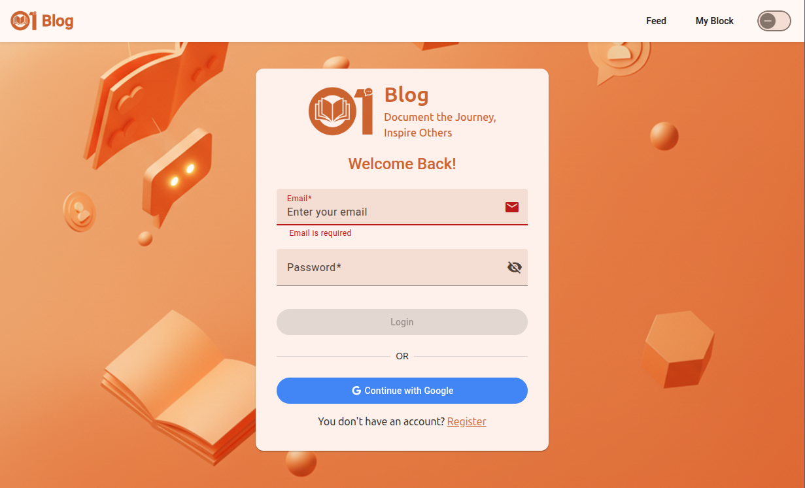
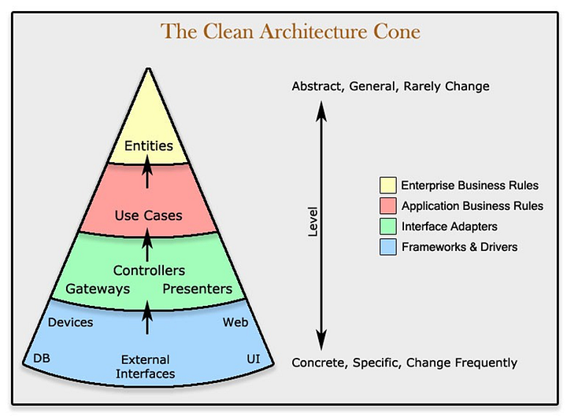

# 01Blog

<div align="center">
  


**A social blogging platform for students to share their learning journey**

[](https://spring.io/projects/spring-boot)
[](https://angular.io/)
[](https://www.postgresql.org/)
[](https://www.docker.com/)

</div>

---

## 📖 Overview

**01Blog** is a fullstack social blogging platform designed for students to document and share their learning experiences, discoveries, and progress. The platform fosters a collaborative environment where users can interact with content, follow peers, and engage in meaningful educational discussions.

Built with modern technologies, 01Blog combines a robust **Java Spring Boot** backend with a dynamic **Angular** frontend to deliver a seamless user experience.

---

## Key Features

- **Secure Authentication** - User registration and login with JWT-based security
- **Role-Based Access Control** - Distinct permissions for Users and Administrators
- **Rich Content Creation** - Create and publish blog posts with formatting options
- **Media Support** - Upload and embed images and videos in posts
- **Social Interactions** - Like, comment, and share posts with the community
- **User Profiles** - Follow other users and build your network
- **Admin Panel** - Comprehensive content moderation and user management tools
- **Responsive Design** - Optimized experience across all devices

---

## 🛠️ Technologies Used

### Backend
- **Java Spring Boot** - RESTful API development
- **Spring Security** - Authentication and authorization
- **PostgreSQL** - Relational database management
- **Docker** - Containerization and deployment

### Frontend
- **Angular** - Component-based UI framework
- **Angular Material** - Modern UI components
- **SCSS** - Enhanced styling capabilities
- **TypeScript** - Type-safe development

---

## 🏗️ Architecture

01Blog follows **Clean Architecture** principles, ensuring maintainability, testability, and scalability through clear separation of concerns.



### Architecture Layers

1. **Entities** - Core business logic, independent of external dependencies
2. **Use Cases** - Application-specific business rules and workflows
3. **Interface Adapters** - Data transformation layer between external sources and business logic
4. **Frameworks & Drivers** - External integrations (database, web framework, UI)

This architectural approach provides:
- Independence from frameworks and external tools
- Highly testable business logic
- Flexibility to swap implementations
- Clear dependency flow (inward only)

[Learn more about Clean Architecture →](https://medium.com/@souzaluis/applying-clean-architecture-in-java-with-spring-boot-framework-part-iv-a3cb82d5421a)

---

## 📊 Database Schema

View the complete database schema and relationships:

**[View Database Schema on dbdiagram.io →](https://dbdiagram.io/d/01Blog-68c981561ff9c616bdf62bbc)**

---

## 📚 Documentation

### Backend Documentation
Comprehensive backend setup, API endpoints, and implementation details:

**[Backend Documentation →](./docs/README-backend.md)**

Topics covered:
- Installation and setup
- API endpoints and usage
- Security configuration
- Database migrations
- Testing strategies

### Frontend Documentation
Frontend architecture, components, and development guide:

**[Frontend Documentation →](./docs/README-frontend.md)**

Topics covered:
- Installation and setup
- Project structure
- Component architecture
- State management
- Styling guidelines

---

## 🚀 Quick Start

### Prerequisites
- Java 17 or higher
- Node.js 18+ and npm
- PostgreSQL 14+
- Docker (optional)

### Installation

1. **Clone the repository**
   ```bash
   git clone https://github.com/hmaach/01blog.git
   cd 01blog
   ```

2. **Backend Setup**
   ```bash
   cd backend
   ./mvnw spring-boot:run
   ```

3. **Frontend Setup**
   ```bash
   cd frontend
   npm install
   ng serve
   ```

4. **Using Docker**
   ```bash
   docker-compose up
   ```

Visit `http://localhost:4200` to access the application.

---

<div align="center">
  
Made with ❤️ by Talent of <a href="https://www.linkedin.com/company/zone01-oujda">ZoneO1 Oujda</a>

</div>