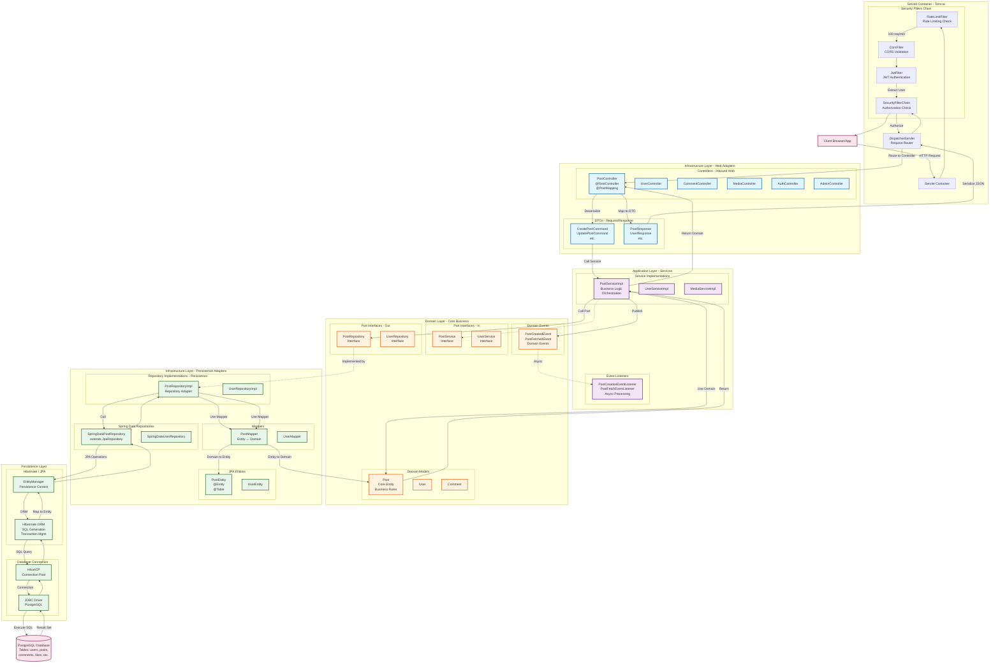

```mermaid
flowchart TB
 subgraph SecurityFilters["Security Filters Chain"]
        RateLimit["RateLimitFilter<br>Rate Limiting Check"]
        CORS["CorsFilter<br>CORS Validation"]
        JWT["JwtFilter<br>JWT Authentication"]
        Security["SecurityFilterChain<br>Authorization Check"]
  end
 subgraph ServletContainer["Servlet Container - Tomcat"]
        Servlet["Servlet Container"]
        SecurityFilters
        Dispatcher["DispatcherServlet<br>Request Router"]
  end
 subgraph Controllers["Controllers - Inbound Web"]
        PostCtrl["PostController <br>@RestController<br>@PostMapping"]
        UserCtrl["UserController"]
        CommentCtrl["CommentController"]
        MediaCtrl["MediaController"]
        AuthCtrl["AuthController"]
        AdminCtrl["AdminController"]
  end
 subgraph DTOs["DTOs - Request/Response"]
        ReqDTO["CreatePostCommand<br>UpdatePostCommand<br>etc."]
        ResDTO["PostResponse<br>UserResponse<br>etc."]
  end
 subgraph InfraWeb["Infrastructure Layer - Web Adapters"]
        Controllers
        DTOs
  end
 subgraph ServiceImpl["Service Implementations"]
        PostService["PostServiceImpl<br>Business Logic<br>Orchestration"]
        UserService["UserServiceImpl"]
        MediaService["MediaServiceImpl"]
  end
 subgraph EventListeners["Event Listeners"]
        EventListener["PostCreationEventListener<br>PostFetchEventListener<br>Async Processing"]
  end
 subgraph AppLayer["Application Layer - Services"]
        ServiceImpl
        EventListeners
  end
 subgraph DomainModels["Domain Models"]
        Post["Post<br>Core Entity<br>Business Rules"]
        User["User"]
        Comment["Comment"]
  end
 subgraph PortIn["Port Interfaces - In"]
        PostPort["PostService<br>Interface"]
        UserPort["UserService<br>Interface"]
  end
 subgraph PortOut["Port Interfaces - Out"]
        PostRepo["PostRepository<br>Interface"]
        UserRepo["UserRepository<br>Interface"]
  end
 subgraph DomainEvents["Domain Events"]
        Events["PostCreatedEvent<br>PostFetchedEvent<br>Domain Events"]
  end
 subgraph DomainLayer["Domain Layer - Core Business"]
        DomainModels
        PortIn
        PortOut
        DomainEvents
  end
 subgraph RepoImpl["Repository Implementations - Persistence"]
        PostRepoImpl["PostRepositoryImpl<br>Repository Adapter"]
        UserRepoImpl["UserRepositoryImpl"]
  end
 subgraph JPAEntities["JPA Entities"]
        PostEntity["PostEntity <br>@Entity<br>@Table"]
        UserEntity["UserEntity"]
  end
 subgraph SpringData["Spring Data Repositories"]
        SpringDataPost["SpringDataPostRepository<br>extends JpaRepository"]
        SpringDataUser["SpringDataUserRepository"]
  end
 subgraph Mappers["Mappers"]
        PostMapper["PostMapper<br>Entity ↔ Domain"]
        UserMapper["UserMapper"]
  end
 subgraph InfraPersist["Infrastructure Layer - Persistence Adapters"]
        RepoImpl
        JPAEntities
        SpringData
        Mappers
  end
 subgraph HibernateJPA["Hibernate / JPA"]
        EntityManager["EntityManager<br>Persistence Context"]
        Hibernate["Hibernate ORM<br>SQL Generation<br>Transaction Mgmt"]
  end
 subgraph DBConnection["Database Connection"]
        Hikari["HikariCP<br>Connection Pool"]
        JDBC["JDBC Driver<br>PostgreSQL"]
  end
 subgraph PersistLayer["Persistence Layer"]
        HibernateJPA
        DBConnection
  end
    Client["Client Browser/App"] -- HTTP Request --> Servlet
    Servlet --> RateLimit
    RateLimit -- 100 req/min --> CORS
    CORS --> JWT
    JWT -- Extract User --> Security
    Security -- Authorize --> Dispatcher
    Dispatcher -- Route to Controller --> PostCtrl
    PostCtrl -- Deserialize --> ReqDTO
    ReqDTO -- Call Service --> PostService
    PostService -- Use Domain --> Post
    PostService -- Call Port --> PostRepo
    PostRepo -. Implemented by .-> PostRepoImpl
    PostRepoImpl -- Use Mapper --> PostMapper & PostMapper
    PostMapper -- Domain to Entity --> PostEntity
    PostRepoImpl -- Call --> SpringDataPost
    SpringDataPost -- JPA Operations --> EntityManager
    EntityManager -- ORM --> Hibernate
    Hibernate -- SQL Query --> Hikari
    Hikari -- Connection --> JDBC
    JDBC -- Execute SQL --> Database[("PostgreSQL Database<br>Tables: users, posts,<br>comments, likes, etc.")]
    Database -- Result Set --> JDBC
    JDBC --> Hikari
    Hikari --> Hibernate
    Hibernate -- Map to Entity --> EntityManager
    EntityManager --> SpringDataPost
    SpringDataPost --> PostRepoImpl
    PostMapper -- Entity to Domain --> Post
    Post -- Return --> PostService
    PostService -- Publish --> Events
    Events -. Async .-> EventListener
    PostService -- Return Domain --> PostCtrl
    PostCtrl -- Map to DTO --> ResDTO
    ResDTO -- Serialize JSON --> Dispatcher
    Dispatcher --> Security
    Security --> Client
    PostService -.-> PostPort

     PostCtrl:::infrastructure
     UserCtrl:::infrastructure
     CommentCtrl:::infrastructure
     MediaCtrl:::infrastructure
     AuthCtrl:::infrastructure
     AdminCtrl:::infrastructure
     ReqDTO:::infrastructure
     ResDTO:::infrastructure
     PostService:::application
     UserService:::application
     MediaService:::application
     EventListener:::application
     Post:::domain
     User:::domain
     Comment:::domain
     PostPort:::domain
     UserPort:::domain
     PostRepo:::domain
     UserRepo:::domain
     Events:::domain
     PostRepoImpl:::persistence
     UserRepoImpl:::persistence
     PostEntity:::persistence
     UserEntity:::persistence
     SpringDataPost:::persistence
     SpringDataUser:::persistence
     PostMapper:::persistence
     UserMapper:::persistence
     EntityManager:::persistence
     Hibernate:::persistence
     Hikari:::persistence
     JDBC:::persistence
     Client:::external
     Database:::external
    classDef infrastructure fill:#e1f5ff,stroke:#01579b,stroke-width:2px
    classDef application fill:#f3e5f5,stroke:#4a148c,stroke-width:2px
    classDef domain fill:#fff3e0,stroke:#e65100,stroke-width:2px
    classDef persistence fill:#e8f5e9,stroke:#1b5e20,stroke-width:2px
    classDef external fill:#fce4ec,stroke:#880e4f,stroke-width:2px
    style PostPort stroke-width:2px,stroke-dasharray: 0


```
