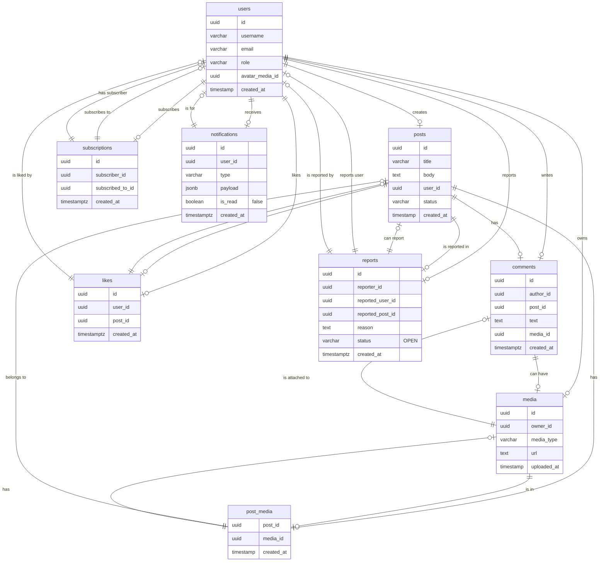

```mermaid
erDiagram
    users {
        uuid id
        varchar username
        varchar email
        varchar role
        uuid avatar_media_id
        timestamp created_at
    }
    
    posts {
        uuid id
        varchar title
        text body
        uuid user_id
        varchar status
        timestamp created_at
    }

    media {
        uuid id
        uuid owner_id
        varchar media_type
        text url
        timestamp uploaded_at
    }

    post_media {
        uuid post_id
        uuid media_id
        timestamp created_at
    }

    comments {
        uuid id
        uuid author_id
        uuid post_id
        text text
        uuid media_id
        timestamptz created_at
    }

    likes {
        uuid id
        uuid user_id
        uuid post_id
        timestamptz created_at
    }

    subscriptions {
        uuid id
        uuid subscriber_id
        uuid subscribed_to_id
        timestamptz created_at
    }

    reports {
        uuid id
        uuid reporter_id
        uuid reported_user_id
        uuid reported_post_id
        text reason
        varchar status "OPEN"
        timestamptz created_at
    }

    notifications {
        uuid id
        uuid user_id
        varchar type
        jsonb payload
        boolean is_read "false"
        timestamptz created_at
    }

    %% Relationships
    users ||--o| posts : "creates"
    users ||--o| media : "owns"
    users ||--o| comments : "writes"
    users ||--o| likes : "likes"
    users ||--o| subscriptions : "subscribes"
    users ||--o| reports : "reports"
    users ||--o| notifications : "receives"

    posts ||--o| comments : "has"
    posts ||--o| likes : "has"
    posts ||--o| post_media : "has"
    posts ||--o| reports : "is reported in"

    media ||--o| post_media : "is in"
    media ||--o| comments : "is attached to"

    post_media ||--|o posts : "belongs to"
    post_media ||--|o media : "has"

    comments ||--o| media : "can have"

    subscriptions ||--o| users : "subscribes to"
    subscriptions ||--o| users : "has subscriber"

    reports ||--o| posts : "can report"
    reports ||--o| users : "reports user"
    reports ||--o| users : "is reported by"

    likes ||--o| posts : "likes"
    likes ||--o| users : "is liked by"
    
    notifications ||--o| users : "is for"
```